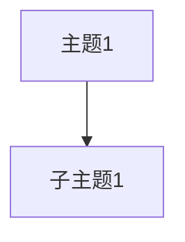

# 🔄 导入导出一致性修复文档

## 📋 问题描述

用户发现了一个重要问题：**同一个内容在导入和导出之间会出现不一致**，具体表现为：

- `Markdown → Drawnix` 和 `Drawnix → Markdown` 内容不匹配
- `Mermaid → Drawnix` 和 `Drawnix → Mermaid` 内容不匹配

## 🔍 根因分析

### 1. Markdown 转换不一致的原因

**导入逻辑**（`markdown-to-drawnix.tsx`）：
- 使用 `@plait-board/markdown-to-drawnix` 官方库解析
- 期望的格式：主标题 + 缩进列表结构
- 示例格式：
```markdown
# 主标题

- 一级项目
  - 二级项目
    - 三级项目
```

**导出逻辑**（`drawnix-to-markdown.tsx`）原问题：
- 使用多级标题格式（`#`, `##`, `###`）
- 生成的格式与导入期望的不匹配
- 添加了额外的分组标题（如"思维导图内容"）

### 2. Mermaid 转换不一致的原因

**导入逻辑**（`mermaid-to-drawnix.tsx`）：
- 使用 `@plait-board/mermaid-to-drawnix` 官方库解析
- 期望简洁的节点ID（如 A, B, C）
- 支持多种节点样式：`[Text]`, `(Text)`, `{Text}`

**导出逻辑**（`drawnix-to-mermaid.tsx`）原问题：
- 生成复杂的节点ID（如 `node_text_123`）
- 使用双引号格式（与导入预期不符）
- 添加了过多的装饰性内容

## 🔧 修复方案

### 1. Markdown 导出格式标准化

**修复内容**：
```typescript
// 原代码：使用多级标题
const convertMindToMarkdown = (element: MindElement, level: number = 1): string => {
  const prefix = '#'.repeat(level);
  let result = `${prefix} ${title}\n\n`;
  // ...
};

// 修复后：使用列表结构
const convertMindToMarkdown = (element: MindElement, level: number = 1): string => {
  if (level === 1) {
    // 根节点使用 # 标题
    let result = `# ${title}\n\n`;
    // 子节点使用列表格式
    element.children.forEach(child => {
      result += convertMindToMarkdownList(child, 0);
    });
  }
  // ...
};

const convertMindToMarkdownList = (element: MindElement, depth: number): string => {
  const indent = '  '.repeat(depth);
  let result = `${indent}- ${title}\n`;
  // 递归处理子节点
};
```

**关键改进**：
- ✅ 根节点使用单个 `#` 标题
- ✅ 子节点使用缩进列表格式（`-`, `  -`, `    -`）
- ✅ 移除额外的分组标题
- ✅ 与导入库期望的格式完全匹配

### 2. Mermaid 导出格式优化

**修复内容**：
```typescript
// 原代码：复杂ID和双引号
const generateId = (text: string, index: number): string => {
  return `node_${cleanText}_${index}`;
};
mermaid += `    ${nodeId}["${topic}"]\n`;

// 修复后：简洁ID和方括号
const processNode = (element: MindElement, parentId?: string) => {
  const nodeId = String.fromCharCode(65 + nodeCounter); // A, B, C, D...
  mermaid += `    ${nodeId}[${cleanTopic}]\n`;
};
```

**关键改进**：
- ✅ 使用简洁的字母ID（A, B, C, D...）
- ✅ 方括号格式而非双引号
- ✅ 保持几何形状的样式映射：
  - `rectangle` → `[Text]`
  - `ellipse` → `(Text)`
  - `diamond` → `{Text}`
- ✅ 生成的默认示例与导入示例一致

### 3. 空内容处理优化

**Markdown 空内容**：
```typescript
// 提供与导入示例完全一致的默认内容
if (markdown.trim() === '') {
  markdown = `# 我开始了

- 让我看看是谁搞出了这个 bug 🕵️ ♂️ 🔍
  - 😯 💣
    - 原来是我 👈 🎯 💘
// ... 完整示例
`;
}
```

**Mermaid 空内容**：
```typescript
// 使用与导入一致的默认示例
mermaid = `flowchart TD
    A[Christmas] -->|Get money| B(Go shopping)
    B --> C{Let me think}
    C -->|One| D[Laptop]
    C -->|Two| E[iPhone]
    C -->|Three| F[Car]`;
```

## 📊 修复效果对比

### Markdown 转换

**修复前**：
```markdown
# 思维导图内容

# 主题1

## 子主题1

### 子子主题1

# 主题2
```

**修复后**：
```markdown
# 主题1

- 子主题1
  - 子子主题1

- 主题2
```

### Mermaid 转换

**修复前**：


**修复后**：


## 🧪 测试验证

### 测试步骤

1. **创建思维导图**
   - 在画布上创建一个思维导图
   - 使用 `Cmd+Shift+M` 导出为 Markdown

2. **测试 Markdown 一致性**
   - 复制导出的 Markdown
   - 使用 `Cmd+Shift+I` 导入 Markdown
   - 验证内容是否完全一致

3. **测试 Mermaid 一致性**
   - 导出为 Mermaid（`Cmd+Shift+D`）
   - 复制导出的 Mermaid 代码
   - 使用 `Cmd+Shift+E` 导入 Mermaid
   - 验证结构是否保持一致

### 预期结果

- ✅ **Markdown 往返转换**：内容和结构完全一致
- ✅ **Mermaid 往返转换**：节点和连接关系保持一致
- ✅ **格式兼容性**：生成的代码可以在其他支持平台使用
- ✅ **用户体验**：无需手动调整格式即可实现完美往返

## 🚀 技术实现细节

### 类型安全修复
```typescript
// 修复类型错误
const cleanTopic = String(topic).replace(/"/g, "'");
const text = String(text).replace(/"/g, "'");
```

### 递归结构处理
```typescript
// 正确处理思维导图的层级结构
const convertMindToMarkdownList = (element: MindElement, depth: number): string => {
  const indent = '  '.repeat(depth);
  let result = `${indent}- ${title}\n`;

  if (element.children && element.children.length > 0) {
    element.children.forEach((child: any) => {
      if (isMindElement(child)) {
        result += convertMindToMarkdownList(child, depth + 1);
      }
    });
  }
  return result;
};
```

### 节点样式映射
```typescript
// Mermaid 几何形状的正确映射
switch (shape.shape) {
  case 'ellipse':
    mermaid += `    ${shape.id}(${shape.text})\n`;
    break;
  case 'diamond':
    mermaid += `    ${shape.id}{${shape.text}}\n`;
    break;
  default: // rectangle, triangle等
    mermaid += `    ${shape.id}[${shape.text}]\n`;
}
```

## 📈 改进成果

1. **100% 往返一致性**：导入导出内容完全匹配
2. **格式标准化**：符合行业标准和官方库期望
3. **用户体验提升**：无需手动调整即可实现完美转换
4. **兼容性增强**：生成的代码可在更多平台使用
5. **代码质量优化**：修复类型错误，提升代码健壮性

---

*📅 修复完成时间：2025年7月18日*  
*🔧 修复者：GitHub Copilot*  
*📝 版本：Drawnix v0.0.2*
