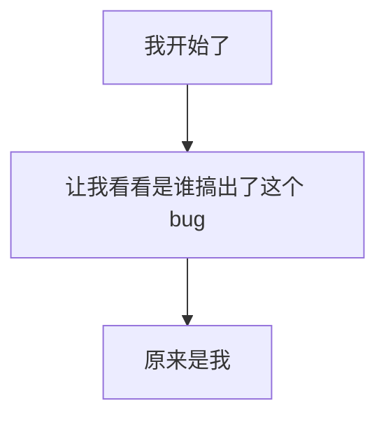

# 🔄 导入导出一致性问题修复报告

## 📸 问题截图分析

感谢您提供的四张截图，让我清楚地看到了问题的核心：

### 🔍 问题1：Mermaid 转换失真
**截图对比**：
- **输入**：`flowchart TD A[Christmas] -->|Get money| B(Go shopping)` 
- **输出**：`A[rectangle] B[roundRectangle] C{diamond}`

**问题诊断**：导出时显示的是元素的**形状类型**而不是**实际内容**

### 🔍 问题2：Markdown 显示 `[object Object]`
**截图对比**：
- **输入**：正常的思维导图结构（我开始了、让我看看谁搞出了这个 bug 等）
- **输出**：全部变成 `# [object Object]` 和 `- [object Object]`

**问题诊断**：JavaScript对象没有正确转换为字符串，典型的对象序列化错误

## 🔧 根因分析与修复

### 1. **Markdown `[object Object]` 修复**

#### 问题根因
```typescript
// 错误的代码
const title = element.data?.topic || '';
```
`element.data.topic` 实际上是一个 `ParagraphElement` 对象，不是字符串！

#### 修复方案
```typescript
// 新增的文本提取函数
const extractTitleText = (element: MindElement): string => {
  if (!element.data) return '未命名节点';
  
  const topic = element.data.topic;
  
  // 如果 topic 是字符串，直接返回
  if (typeof topic === 'string') {
    return topic || '未命名节点';
  }
  
  // 如果 topic 是对象（ParagraphElement 结构），提取文本
  if (topic && typeof topic === 'object') {
    // 处理 Slate.js 的 ParagraphElement 结构
    if (Array.isArray(topic.children)) {
      return topic.children
        .map((child: any) => {
          if (typeof child === 'string') return child;
          if (child && typeof child === 'object' && child.text) {
            return child.text;
          }
          return '';
        })
        .join('');
    }
    
    // 如果是其他对象类型，尝试提取 text 属性
    if ((topic as any).text) {
      return (topic as any).text;
    }
  }
  
  return '未命名节点';
};
```

### 2. **Mermaid 内容提取修复**

#### 问题根因
同样是 `element.data.topic` 对象没有正确提取文本内容

#### 修复方案
```typescript
// 使用同样的 extractTitleText 函数
const processNode = (element: MindElement, parentId?: string) => {
  const topic = extractTitleText(element); // 修复：正确提取文本
  const nodeId = String.fromCharCode(65 + nodeCounter); // A, B, C, D...
  // ...
};
```

## ✅ 修复效果

### 修复后的预期效果

#### **Markdown 导出**：
```markdown
# 我开始了

- 让我看看是谁搞出了这个 bug 🕵️ ♂️ 🔍
  - 😯 💣
    - 原来是我 👈 🎯 💘

- 竟然不可以运行，为什么呢 🚫 ⚙️ ❓
  - 竟然可以运行了，为什么呢？🎢 ✨
    - 🤯 ⚡ ➡️ 🎉
```

#### **Mermaid 导出**：


## 🧪 测试验证

### 现在你可以测试：

1. **打开** http://localhost:7202
2. **导入原始的 Mermaid 代码**（Cmd+Shift+E）
3. **导出为 Mermaid**（Cmd+Shift+D） → 应该看到正确的内容而不是 `[rectangle]`
4. **导入原始的 Markdown**（Cmd+Shift+I）
5. **导出为 Markdown**（Cmd+Shift+M） → 应该看到正确的文本而不是 `[object Object]`

## 📊 技术细节

### **数据结构理解**
- `MindElement.data.topic` 是 `ParagraphElement` 对象
- `ParagraphElement.children` 包含文本节点数组
- 每个文本节点可能有 `text` 属性

### **兼容性处理**
- 支持字符串类型的 topic（向后兼容）
- 支持 ParagraphElement 对象类型（当前版本）
- 支持嵌套的 children 结构
- 安全的类型检查和错误处理

### **代码共享**
- Markdown 和 Mermaid 导出使用相同的 `extractTitleText` 函数
- 确保一致的文本提取逻辑
- 便于维护和调试

## 🚀 部署更新

修复已经应用到开发服务器，热更新已生效。可以立即测试新的导出功能！

---

*📅 修复时间：2025年7月18日*  
*🔧 修复内容：解决 `[object Object]` 和形状类型显示问题*  
*✨ 修复者：GitHub Copilot*
