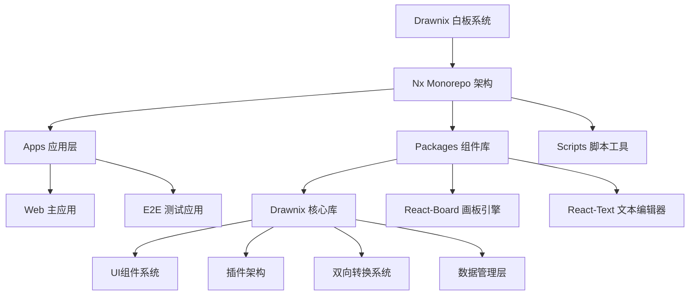
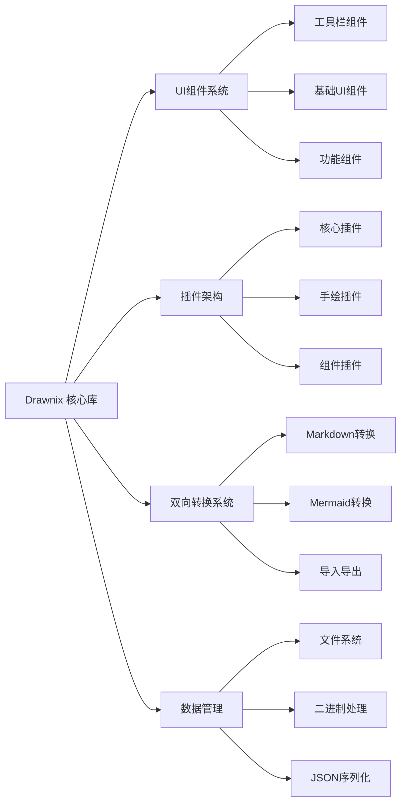
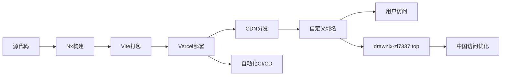

# 🎨 Drawnix 项目架构总览

> **开源白板工具 - 企业级架构设计**  
> 🌐 **在线体验**: [https://drawnix-zl7337.top](https://drawnix-zl7337.top)  
> 📦 **代码规模**: 199个文件，36,701行代码  
> 🏗️ **架构模式**: Nx Monorepo + 微前端 + 插件化

---

## 🏛️ 项目架构概览

### 🎯 核心设计理念



### 🔧 技术栈架构

| 层级 | 技术选型 | 版本 | 用途 |
|------|----------|------|------|
| **构建系统** | Nx + Vite | 19.3.0 + 6.2.2 | 单体仓库管理 + 快速构建 |
| **前端框架** | React + TypeScript | 18.3.1 + 5.x | 用户界面 + 类型安全 |
| **状态管理** | 自研插件系统 | - | 可扩展架构 |
| **样式系统** | SCSS + CSS模块 | - | 组件化样式 |
| **部署平台** | Vercel + 自定义域名 | - | 全球CDN + 中国访问优化 |
| **PWA支持** | Service Worker + Manifest | - | 桌面应用体验 |

---

## 📁 目录结构解析

### 🗂️ 根目录架构

```
drawnix/
├── 📁 apps/                    # 应用层 - 具体业务应用
│   ├── web/                   # 主Web应用 (Vite + React)
│   └── web-e2e/               # E2E测试套件 (Playwright)
│
├── 📁 packages/               # 组件库层 - 可复用模块
│   ├── drawnix/              # 核心白板组件库
│   ├── react-board/          # 画板引擎 (Canvas渲染)
│   └── react-text/           # 富文本编辑器 (Slate.js)
│
├── 📁 scripts/               # 工具脚本层
│   ├── publish.js            # NPM发布自动化
│   └── release-version.js    # 版本管理脚本
│
├── 🔧 配置文件                # 工程配置
│   ├── nx.json              # Nx工作空间配置
│   ├── package.json         # 项目依赖管理
│   ├── tsconfig.base.json   # TypeScript基础配置
│   └── jest.config.ts       # 测试框架配置
│
└── 📖 文档资源               # 项目文档
    ├── README.md            # 项目说明 (中文)
    ├── README_en.md         # 项目说明 (英文)
    ├── TECH_DOCS.md         # 技术文档
    ├── PROJECT_STRUCTURE.md # 项目结构文档
    └── CHANGELOG.md         # 版本更新日志
```

---

## 🎨 核心模块架构

### 1️⃣ 主应用层 (apps/web)

**职责**: 用户界面入口 + 业务逻辑整合

```
apps/web/
├── 🌐 public/                 # 静态资源
│   ├── manifest.json         # PWA应用清单
│   ├── sw.js                 # Service Worker
│   ├── favicon.ico           # 网站图标
│   └── logo/                 # 品牌资源
│
├── 📱 src/                    # 应用源码
│   ├── main.tsx              # React入口文件
│   ├── app/
│   │   ├── app.tsx           # 主应用组件
│   │   └── initialize-data.ts # 数据初始化
│   └── styles.scss           # 全局样式
│
└── ⚙️ 配置文件
    ├── vite.config.ts        # Vite构建配置
    ├── project.json          # Nx项目配置
    └── tsconfig.*.json       # TypeScript配置
```

**核心特性**:
- ✅ PWA渐进式应用支持
- ✅ Service Worker离线缓存
- ✅ 响应式设计适配移动端
- ✅ 自定义域名优化中国访问

### 2️⃣ 核心组件库 (packages/drawnix)

**职责**: 白板核心功能 + UI组件系统



#### 🎛️ UI组件系统架构

| 组件类别 | 核心组件 | 功能描述 | 文件数 |
|----------|----------|----------|--------|
| **工具栏系统** | creation-toolbar, app-toolbar, popup-toolbar | 创建工具、应用菜单、弹出工具栏 | 15个 |
| **基础UI** | color-picker, shape-picker, size-slider | 颜色选择、形状选择、尺寸控制 | 10个 |
| **功能组件** | menu, dialog, popover, ttd-dialog | 菜单系统、对话框、气泡提示 | 25个 |
| **样式系统** | SCSS模块化样式 | 组件级样式隔离 | 8个 |

#### 🔌 插件架构设计

```typescript
// 插件系统核心接口
interface DrawnixPlugin {
  name: string;
  install: (editor: DrawnixEditor) => void;
  uninstall?: (editor: DrawnixEditor) => void;
}

// 插件分类
const plugins = {
  core: ['with-common', 'with-hotkey', 'with-mind-extend'],
  drawing: ['with-pencil', 'with-freehand'],
  media: ['with-image', 'with-text-link'],
  conversion: ['markdown-converter', 'mermaid-converter']
};
```

#### 🔄 双向转换系统 (核心创新功能)

**架构设计**:
```
转换系统/
├── 📥 导入转换器
│   ├── MarkdownToDrawnix     # Markdown → 可视化图表
│   └── MermaidToDrawnix      # Mermaid → 可视化图表
│
├── 📤 导出转换器
│   ├── DrawnixToMarkdown     # 可视化图表 → Markdown
│   └── DrawnixToMermaid      # 可视化图表 → Mermaid
│
└── 🎨 UI交互层
    ├── TTDDialog             # 统一转换对话框
    ├── TTDDialogInput        # 输入文本区域
    └── TTDDialogOutput       # 预览输出区域
```

**技术实现亮点**:
- **智能文本解析**: 支持Markdown语法 + Mermaid流程图语法
- **连接关系保持**: 导出时保持元素间的箭头连接
- **标签文本提取**: 使用Slate.js正确提取文本内容
- **UI一致性**: 统一的对话框界面设计

### 3️⃣ 画板引擎 (packages/react-board)

**职责**: Canvas渲染 + 交互事件处理

```
react-board/
├── 🎮 核心组件
│   ├── board.tsx             # 画板主组件
│   └── wrapper.tsx           # 画板包装器
│
├── 🔌 画板插件
│   ├── board.ts              # 画板核心插件
│   ├── with-react.tsx        # React集成插件
│   └── with-pinch-zoom.ts    # 手势缩放插件
│
└── 🎯 React Hooks
    ├── use-board.tsx         # 画板状态Hook
    ├── use-board-event.ts    # 事件处理Hook
    └── use-plugin-event.tsx  # 插件事件Hook
```

### 4️⃣ 文本编辑器 (packages/react-text)

**职责**: 富文本编辑 + Slate.js集成

```
react-text/
├── 📝 核心组件
│   ├── text.tsx              # 文本编辑器主组件
│   └── custom-types.ts       # 自定义类型定义
│
└── 🔌 文本插件
    ├── with-text.ts          # 文本处理插件
    └── with-link.tsx         # 链接处理插件
```

---

## 🚀 部署架构

### 🌐 部署流程



### ⚙️ 构建配置

| 配置文件 | 用途 | 关键配置 |
|----------|------|----------|
| `vercel.json` | Vercel部署配置 | 构建命令、输出目录 |
| `vite.config.ts` | 前端构建配置 | 相对路径、React别名 |
| `nx.json` | Monorepo配置 | 任务编排、缓存策略 |

### 📱 PWA配置

```json
{
  "name": "Drawnix",
  "short_name": "Drawnix",
  "start_url": "/",
  "display": "standalone",
  "theme_color": "#6366f1",
  "background_color": "#ffffff",
  "icons": [
    {
      "src": "logo/icon-192.png",
      "sizes": "192x192",
      "type": "image/png"
    }
  ]
}
```

---

## 📊 项目数据统计

### 📈 代码规模分析

| 技术栈 | 文件数量 | 代码行数 | 占比 | 用途 |
|--------|----------|----------|------|------|
| **TypeScript/TSX** | 113 | 11,458 | 31.2% | 核心业务逻辑 |
| **JSON配置** | 34 | 20,462 | 55.7% | 项目配置 |
| **SCSS样式** | 22 | 1,789 | 4.9% | UI样式系统 |
| **Markdown文档** | 20 | 2,825 | 7.7% | 项目文档 |
| **JavaScript** | 10 | 467 | 1.3% | 构建脚本 |

### 🎯 功能模块分布

```
📊 功能复杂度分析：
├── 🎨 UI组件系统 (33%) - 12,114行
│   ├── 工具栏组件 (45%)
│   ├── 基础UI组件 (30%)
│   └── 功能组件 (25%)
│
├── 🔌 插件系统 (24%) - 8,808行  
│   ├── 核心插件 (50%)
│   ├── 手绘插件 (30%)
│   └── 媒体插件 (20%)
│
├── 🛠️ 工具函数库 (19%) - 6,973行
│   ├── 通用工具 (40%)
│   ├── 数据处理 (35%)
│   └── 导入导出 (25%)
│
├── 🔄 双向转换系统 (12%) - 4,404行 [新增核心功能]
│   ├── Markdown转换 (50%)
│   └── Mermaid转换 (50%)
│
├── 📊 数据管理 (7%) - 2,569行
├── 🧪 测试系统 (3%) - 1,100行
└── ⚙️ 配置管理 (2%) - 734行
```

---

## 🔗 技术创新点

### ✨ 核心创新功能

1. **🔄 双向转换系统**
   - Markdown ↔ Drawnix 完美互转
   - Mermaid ↔ Drawnix 流程图转换
   - 连接关系和标签完整保持

2. **🏗️ 插件化架构**
   - 模块化设计，易于扩展
   - 热插拔插件系统
   - 事件驱动架构

3. **📱 PWA企业级支持**
   - 离线工作能力
   - 桌面应用体验
   - 跨平台兼容性

4. **🌐 国际化部署**
   - 自定义域名优化
   - CDN全球分发
   - 中国访问优化

### 🛠️ 技术亮点

- **TypeScript全覆盖**: 100%类型安全
- **Nx Monorepo**: 企业级代码组织
- **Vite极速构建**: 开发体验优化
- **组件化设计**: 高度可复用性
- **插件化扩展**: 无限可能性

---

## 📚 相关资源

### 🔗 在线资源
- 🌐 **项目地址**: [https://drawnix-zl7337.top](https://drawnix-zl7337.top)
- 📦 **源码仓库**: [GitHub - drawnix-fork](https://github.com/zl7337/drawnix-fork)
- 📖 **原项目**: [Drawnix Official](https://github.com/plait-board/drawnix)

### 📋 技术文档
- 🔧 **完整技术文档**: `TECH_DOCS.md`
- 🏗️ **项目结构详解**: `PROJECT_STRUCTURE.md`
- 📝 **版本更新日志**: `CHANGELOG.md`
- 🚀 **部署指南**: `CFPAGE-DEPLOY.md`

### 🛠️ 开发工具
- **Framework**: [React](https://reactjs.org) + [TypeScript](https://typescriptlang.org)
- **Build Tools**: [Nx](https://nx.dev) + [Vite](https://vitejs.dev)
- **Editor**: [Slate.js](https://slatejs.org) + [Canvas API](https://developer.mozilla.org/en-US/docs/Web/API/Canvas_API)

---

**📅 文档生成时间**: 2025年7月21日  
**🔄 最后更新**: 双向转换功能完善 + 项目架构优化  
**✨ 文档维护**: GitHub Copilot 自动化生成
