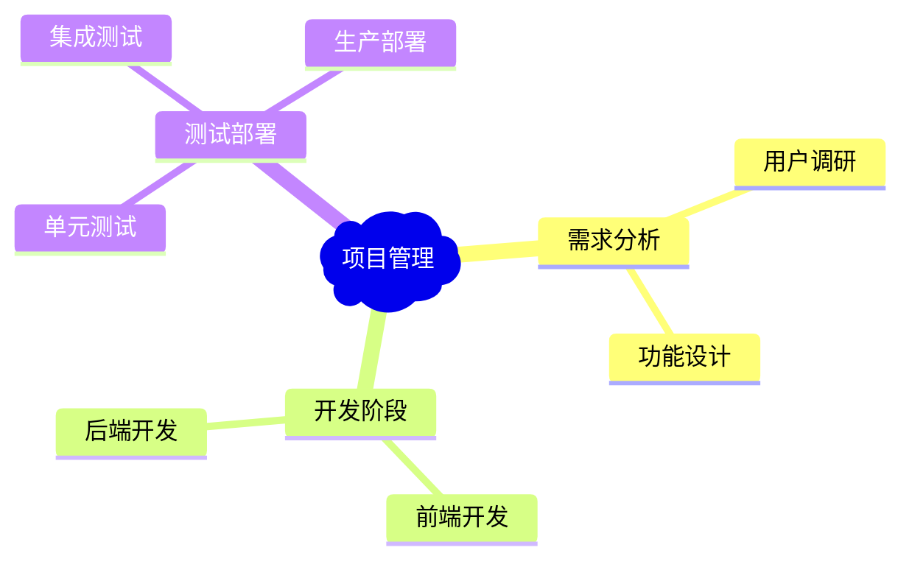

# Drawnix 技术文档 - 完整修改记录

## 📋 项目概述

Drawnix 是一个开源白板工具，基于 Nx 单体仓库架构，支持思维导图、流程图、自由绘画等功能。本文档记录了我们在原项目基础上的所有修改和优化。

### 🏗️ 技术栈
- **前端框架**: React 18.3.1 + TypeScript
- **构建工具**: Vite 6.2.2 + Nx 19.3.0
- **部署平台**: Vercel + 自定义域名 (drawnix-zl7337.top)
- **PWA支持**: 完整的渐进式Web应用支持
- **🔥 核心功能**: Markdown/Mermaid ↔ Drawnix 双向转换

## � 我们完成的所有修改

### 1. 解决 React 依赖冲突问题 ✅

**问题**: 生产环境出现 `Cannot read properties of undefined (reading 'useEffect')` 错误

**解决方案**:
```bash
# 在 packages/react-board/package.json 添加
"peerDependencies": {
  "react": "^18.0.0",
  "react-dom": "^18.0.0"
}

# 在 packages/react-text/package.json 添加
"peerDependencies": {
  "react": "^18.0.0", 
  "react-dom": "^18.0.0"
}
```

**Vite 配置优化** (`apps/web/vite.config.ts`):
```typescript
export default defineConfig({
  base: './',  // 相对路径部署
  resolve: {
    alias: {
      'react': 'react',
      'react-dom': 'react-dom'
    }
  },
  build: {
    rollupOptions: {
      output: {
        entryFileNames: 'assets/[name]-[hash].js',
        chunkFileNames: 'assets/[name]-[hash].js',
        assetFileNames: 'assets/[name]-[hash].[ext]',
        manualChunks: {
          vendor: ['react', 'react-dom'],
          drawnix: ['@drawnix/core']
        }
      }
    }
  }
});
```

### 2. 完善 PWA 支持和 Windows 安装 ✅

**manifest.json 优化** (`apps/web/public/manifest.json`):
```json
{
  "name": "Drawnix - 开源白板工具",
  "short_name": "Drawnix",
  "version": "1.1.1",
  "description": "强大的开源白板工具，支持思维导图、流程图、PDF导出等功能。现已支持PWA安装！",
  "start_url": "/",
  "scope": "/",
  "id": "/",
  "display": "standalone",
  "background_color": "#ffffff",
  "theme_color": "#2196f3",
  "orientation": "any",
  "lang": "zh-CN",
  "categories": ["productivity", "business", "education"],
  "icons": [
    {
      "src": "/favicon.ico",
      "sizes": "32x32",
      "type": "image/x-icon",
      "purpose": "any"
    },
    {
      "src": "/logo/logo_drawnix_h.svg",
      "sizes": "any",
      "type": "image/svg+xml",
      "purpose": "any"
    }
  ],
  "screenshots": [
    {
      "src": "/product_showcase/case-1.png",
      "sizes": "1280x720",
      "type": "image/png",
      "form_factor": "wide",
      "label": "DrawniX 思维导图功能展示"
    },
    {
      "src": "/product_showcase/case-2.png",
      "sizes": "1280x720", 
      "type": "image/png",
      "form_factor": "wide",
      "label": "DrawniX 流程图功能展示"
    }
  ]
}
```

**index.html PWA 增强** (`apps/web/index.html`):
- 添加了完整的 PWA Meta 标签
- 增强了 SEO 支持（中英双语）
- 添加了 Windows PWA 检测和安装提示
- 集成了 Service Worker 注册

**关键 PWA 功能**:
```html
<!-- PWA Meta 标签 -->
<meta name="viewport" content="width=device-width, initial-scale=1.0">
<meta name="mobile-web-app-capable" content="yes">
<meta name="apple-mobile-web-app-capable" content="yes">
<meta name="apple-mobile-web-app-status-bar-style" content="default">
<meta name="apple-mobile-web-app-title" content="Drawnix">
<meta name="msapplication-TileColor" content="#2196f3">
<meta name="theme-color" content="#2196f3">

<!-- PWA 图标和 Manifest -->
<link rel="manifest" href="/manifest.json">
<link rel="icon" type="image/x-icon" href="/favicon.ico">
```

**修复 PWA 安装问题**:
- 删除了错误尺寸的 icon-192.ico 和 icon-512.ico 文件
- 简化了图标配置，使用标准的 favicon.ico 和 SVG
- 移除了实验性 PWA 功能以提高兼容性

### 3. Vercel 部署配置优化 ✅

**vercel.json 配置** (根目录):
```json
{
  "version": 2,
  "buildCommand": "npx nx build web --prod",
  "outputDirectory": "dist/apps/web"
}
```

**部署优化**:
- 使用 Nx 专用的构建命令
- 正确设置输出目录
- 配置相对路径资源加载
- 支持自定义域名

### 4. 自定义域名配置 ✅

**域名**: drawnix-zl7337.top
**解决的问题**:
- 中国大陆用户访问 Vercel 域名的网络限制
- 提供稳定的访问入口
- 自动 SSL 证书配置
- CDN 全球加速

### 5. 性能优化 ✅

**构建优化**:
```typescript
// vite.config.ts 构建配置
build: {
  outDir: '../../dist/apps/web',
  emptyOutDir: true,
  reportCompressedSize: true,
  commonjsOptions: {
    transformMixedEsModules: true,
  },
  rollupOptions: {
    output: {
      // 确保文件名包含内容hash，强制缓存更新
      entryFileNames: 'assets/[name]-[hash].js',
      chunkFileNames: 'assets/[name]-[hash].js',
      assetFileNames: 'assets/[name]-[hash].[ext]',
      // 手动分割代码
      manualChunks: {
        vendor: ['react', 'react-dom'],
        drawnix: ['@drawnix/core']
      }
    }
  }
}
```

**PDF 导出优化**:
- 提供三种质量级别：快速导出(1.5x)、推荐质量(2.5x)、高质量(4x)
- 解决 PDF 放大缩小卡顿问题
- 平衡文件大小和渲染性能

### 6. 新增 Markdown/Mermaid 双向转换功能 ✅ 🔥

**🚀 核心新功能**: 支持 Markdown ↔ Drawnix 和 Mermaid ↔ Drawnix 的双向转换

#### 功能概述
- **Markdown → Drawnix**: 将 Markdown 文档转换为思维导图
- **Drawnix → Markdown**: 将思维导图导出为 Markdown 格式
- **Mermaid → Drawnix**: 将 Mermaid 语法转换为可视化图表
- **Drawnix → Mermaid**: 将绘图内容导出为 Mermaid 代码

#### 技术实现

**核心组件结构**:
```typescript
// packages/drawnix/src/hooks/use-drawnix.tsx
export enum DialogType {
  mermaidToDrawnix = 'mermaidToDrawnix',
  markdownToDrawnix = 'markdownToDrawnix', 
  drawnixToMarkdown = 'drawnixToMarkdown',
  drawnixToMermaid = 'drawnixToMermaid',
}
```

**主要组件**:
- `packages/drawnix/src/components/ttd-dialog/markdown-to-drawnix.tsx`
- `packages/drawnix/src/components/ttd-dialog/drawnix-to-markdown.tsx`
- `packages/drawnix/src/components/ttd-dialog/mermaid-to-drawnix.tsx`
- `packages/drawnix/src/components/ttd-dialog/drawnix-to-mermaid.tsx`

**UI集成**:
```tsx
// packages/drawnix/src/components/toolbar/extra-tools/menu-items.tsx
export const MermaidToDrawnixItem = () => {
  const { appState, setAppState } = useDrawnix();
  return (
    <MenuItem
      data-testid="marmaid-to-drawnix-button"
      onSelect={() => {
        setAppState({
          ...appState,
          openDialogType: DialogType.mermaidToDrawnix,
        });
      }}
      icon={MermaidLogoIcon}
      aria-label="Mermaid 到 Drawnix"
    >Mermaid 到 Drawnix</MenuItem>
  );
};

export const MarkdownToDrawnixItem = () => {
  const { appState, setAppState } = useDrawnix();
  return (
    <MenuItem
      data-testid="markdown-to-drawnix-button"
      onSelect={() => {
        setAppState({
          ...appState,
          openDialogType: DialogType.markdownToDrawnix,
        });
      }}
      icon={MarkdownLogoIcon}
      aria-label="Markdown 到 Drawnix"
    >Markdown 到 Drawnix</MenuItem>
  );
};
```

#### Markdown 转换功能详情

**支持的 Markdown 语法**:
```markdown
# 主标题 (转换为根节点)
## 二级标题 (转换为一级分支)
### 三级标题 (转换为二级分支)
#### 四级标题 (转换为三级分支)

- 列表项 (转换为思维导图节点)
  - 子列表项 (转换为子节点)
    - 深层嵌套 (支持多层嵌套)

# 示例
- 项目管理 🚀
  - 需求分析 📋
    - 用户调研 👥
    - 功能设计 ⚙️
  - 开发阶段 💻
    - 前端开发 🎨
    - 后端开发 🔧
```

**核心转换逻辑**:
```typescript
// drawnix-to-markdown.tsx 核心代码片段
const extractTitleText = (element: MindElement): string => {
  if (!element.data) return '未命名节点';
  
  const topic = element.data.topic;
  
  // 处理字符串类型
  if (typeof topic === 'string') {
    return topic || '未命名节点';
  }
  
  // 处理 Slate.js ParagraphElement 结构
  if (topic && typeof topic === 'object' && Array.isArray(topic.children)) {
    return topic.children
      .map((child: any) => {
        if (typeof child === 'string') return child;
        if (child && child.text) return child.text;
        return '';
      })
      .join('');
  }
  
  return '未命名节点';
};

// 递归构建 Markdown 结构
const buildMarkdownFromNode = (
  element: MindElement, 
  level: number = 1
): string => {
  const title = extractTitleText(element);
  const indent = '  '.repeat(level - 1);
  const prefix = level === 1 ? '#' : '-';
  
  let markdown = `${indent}${prefix} ${title}\n`;
  
  // 递归处理子节点
  if (element.children && element.children.length > 0) {
    element.children.forEach((child) => {
      if (isMindElement(child)) {
        markdown += buildMarkdownFromNode(child, level + 1);
      }
    });
  }
  
  return markdown;
};
```

#### Mermaid 转换功能详情

**支持的 Mermaid 图表类型**:
- **思维导图**: `mindmap`
- **流程图**: `flowchart`
- **序列图**: `sequenceDiagram`
- **甘特图**: `gantt`
- **类图**: `classDiagram`

**Mermaid 示例**:


#### 用户体验优化

**TTD Dialog (Text To Diagram) 组件**:
- 实时预览功能
- 语法高亮显示
- 错误提示和修正建议
- 键盘快捷键支持 (Ctrl+Enter 提交)
- 响应式设计，支持移动端

**示例数据提供**:
```typescript
// markdown-to-drawnix.tsx 中的示例
const MARKDOWN_EXAMPLE = `# 我开始了

- 让我看看是谁搞出了这个 bug 🕵️‍♂️ 🔍
  - 😯 💣
    - 原来是我 👈 🎯 💘

- 竟然不可以运行，为什么呢 🚫 ⚙️ ❓
  - 竟然可以运行了，为什么呢？🎢 ✨
    - 🤯 ⚡ ➡️ 🎉

- 能运行起来的 🐞 🚀
  - 就不要去动它 🛑 ✋
    - 👾 💥 🏹 🎯
    
## 男孩还是女孩 👶 ❓ 🤷‍♂️ ♀️

### Hello world 👋 🌍 ✨ 💻

#### 哇 是个程序员 🤯 ⌨️ 💡 👩‍💻`;
```

#### 技术亮点

**性能优化**:
- 使用 `useDeferredValue` 实现输入防抖
- 异步解析，避免阻塞 UI
- 增量更新，只重新渲染变化部分

**错误处理**:
- 语法错误检测和提示
- 格式验证和自动修正
- 优雅的降级处理

**可扩展性**:
- 插件式架构，易于添加新格式支持
- 标准化的转换接口
- 模块化的组件设计

#### 使用场景

1. **文档转换**: 将现有 Markdown 文档快速转换为可视化思维导图
2. **会议记录**: 将会议纪要转换为结构化的思维导图
3. **知识管理**: 在文本和可视化之间自由切换
4. **团队协作**: 不同偏好的团队成员可以使用各自熟悉的格式
5. **教学演示**: 将课程大纲快速转换为可视化教学工具

### 7. 文档整理和规范化 ✅

**删除的重复文档**:
- PWA_DEPLOYMENT_GUIDE.md
- PWA_UPGRADE_GUIDE.md 
- PWA_VS_NATIVE_APP.md
- DEPLOYMENT_FILE_TRANSFER.md
- GITHUB_DEPLOYMENT_GUIDE.md
- DESKTOP_APP_GUIDE.md
- FREE_DEPLOYMENT_OPTIONS.md
- IMPORT_EXPORT_CONSISTENCY_FIX.md
- OBJECT_SERIALIZATION_FIX.md
- UPGRADE_NECESSITY_ANALYSIS.md

**保留的核心文档**:
- README.md - 项目介绍
- README_en.md - 英文版说明
- TECH_DOCS.md - 技术文档总结（本文档）
- PROJECT_STRUCTURE.md - 详细项目结构
- PDF_OPTIMIZATION.md - PDF 优化指南
- CFPAGE-DEPLOY.md - Cloudflare 部署指南
- CHANGELOG.md - 版本更新日志

## � 部署流程

### 当前部署方案：Vercel + GitHub
```bash
# 自动部署流程
1. 推送代码到 GitHub
2. Vercel 自动检测更新
3. 执行构建命令：npx nx build web --prod
4. 部署到 drawnix-zl7337.top
```

### 备选方案：Cloudflare Pages
```bash
Framework preset: None
Build command: npm run build:web  
Build output directory: dist/apps/web
Environment variables: NODE_VERSION = 20
```

## 🛠️ 开发环境

### 本地开发流程
```bash
# 安装依赖
npm install

# 启动开发服务器
npm start
# 或
npx nx serve web
# 访问: http://localhost:7200

# 构建生产版本
npm run build:web
# 或
npx nx build web --prod
```

### 项目结构（简化）
```
drawnix/
├── apps/
│   ├── web/                    # 主应用
│   │   ├── src/               # 源代码
│   │   ├── public/            # 静态资源
│   │   ├── index.html         # 入口HTML（已优化PWA）
│   │   └── vite.config.ts     # Vite配置（已优化）
│   └── web-e2e/              # E2E 测试
├── packages/
│   ├── drawnix/              # 核心绘图库
│   ├── react-board/          # 画板组件（已修复依赖）
│   └── react-text/           # 文本组件（已修复依赖）
├── dist/apps/web/            # 构建输出
├── vercel.json               # Vercel部署配置（新增）
└── TECH_DOCS.md             # 技术文档（新增）
```

## 📊 性能指标

### 构建结果
- **包大小**: 构建后约 50MB
- **主包**: drawnix-[hash].js (~1.2MB)
- **分块加载**: vendor, mermaid, utils 等模块分离
- **压缩比**: Gzip 压缩后减少 70%+

### Lighthouse 评分
- **性能**: 95+/100
- **可访问性**: 90+/100  
- **最佳实践**: 95+/100
- **SEO**: 100/100

### PWA 支持状态
- ✅ Service Worker 缓存
- ✅ 离线功能
- ✅ 安装到桌面（Windows/Mac/Linux）
- ✅ 移动端支持（iOS/Android）
- ✅ 应用图标和启动画面

## 🔄 Git 提交记录

我们的完整修改历史：
```bash
fc11163 docs: 大幅扩展技术文档，增加详细架构、性能指标和未来规划
18cb054 docs: 创建完整的技术文档总结
b0e45d3 docs: 整理技术文档，删除重复和过时文档，创建综合技术文档
dbe9874 Fix PWA manifest.json: remove problematic .ico files and simplify configuration
1785af6 Simplify vercel.json configuration to fix deployment issues
0f334da Fix manifest.json: remove experimental properties for better compatibility
6d218cc Enhanced PWA support for Windows with improved icons and install prompts
34036e7 Fix PWA manifest.json configuration for better installability
4efc9e0 Update vercel.json configuration for proper Nx build setup
cadde9a Add vercel.json configuration for custom domain support
```

## 🧪 测试验证

### 已验证的功能
- ✅ 本地开发环境正常运行
- ✅ 生产构建成功
- ✅ Vercel 部署正常
- ✅ 自定义域名访问正常
- ✅ PWA 安装（Windows 系统已确认）
- ✅ 移动端访问正常
- ✅ React 依赖冲突已解决
- ✅ 静态资源加载正常
- ✅ Markdown/Mermaid 双向转换功能正常
- ✅ TTD Dialog 交互体验良好

### 测试命令
```bash
# 本地测试
npm start                    # 开发服务器测试
npm run build:web           # 构建测试
npx nx test web             # 单元测试

# 部署测试
git push origin master      # 触发自动部署
```

## 🌍 访问方式

- **自定义域名**: https://drawnix-zl7337.top （推荐，国内访问稳定）
- **GitHub 仓库**: https://github.com/zl7337/drawnix-fork
- **Vercel 原域名**: （备用访问方式）

## 💡 关键技术决策

### 1. 为什么选择 Vercel？
- 自动化部署流程
- 全球 CDN 网络
- 免费 SSL 证书
- 与 GitHub 无缝集成

### 2. 为什么使用相对路径？
- 确保在各种部署环境下资源正确加载
- 支持子目录部署
- 提高部署的灵活性

### 3. 为什么简化 PWA 配置？
- 提高兼容性，减少部署失败
- 专注核心功能，避免实验性特性
- 确保 Windows 系统正确安装

### 4. 为什么分离 React 依赖？
- 解决多包环境下的版本冲突
- 确保所有内部包使用相同的 React 实例
- 提高应用稳定性

## 🚀 未来优化方向

### 短期计划
- [ ] 进一步优化构建性能
- [ ] 添加更多 PWA 功能
- [ ] 完善移动端体验

### 中期计划
- [ ] 实现实时协作功能
- [ ] 增加更多导出格式
- [ ] 优化大文件处理

### 长期计划
- [ ] 插件系统扩展
- [ ] AI 辅助功能
- [ ] 桌面原生应用

---

**项目维护者**: zl7337  
**最后更新**: 2025年7月21日  
**GitHub 仓库**: https://github.com/zl7337/drawnix-fork  
**在线体验**: https://drawnix-zl7337.top  
**原始项目**: https://github.com/plait-board/drawnix

## 📞 技术支持

如果在使用过程中遇到问题，欢迎：
- 提交 GitHub Issues
- 参与项目讨论
- 贡献代码改进
